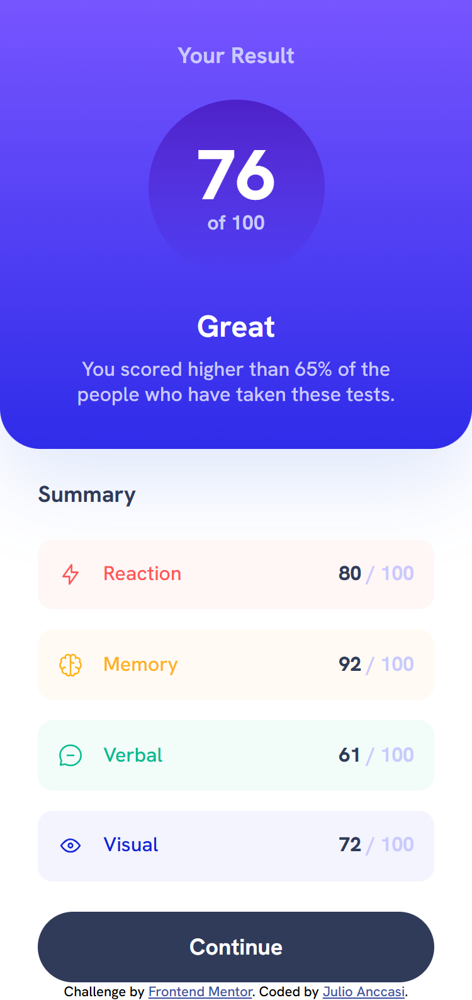
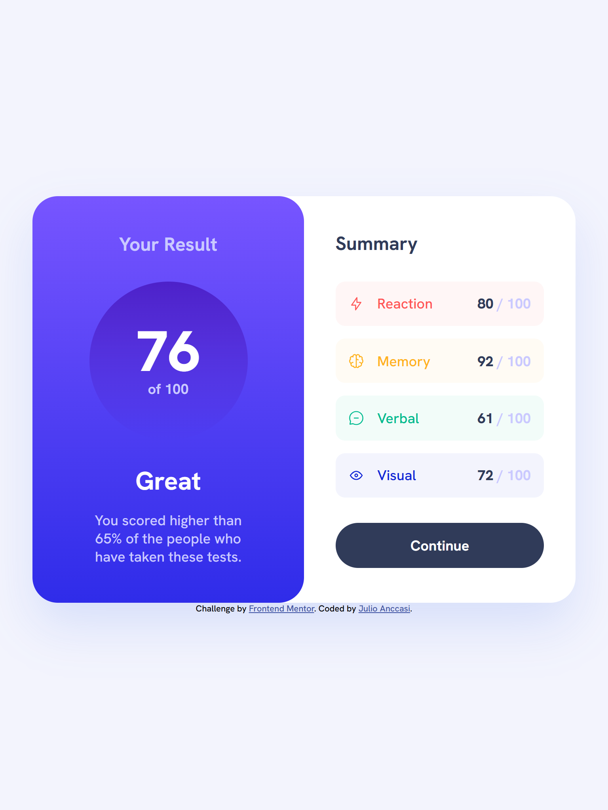
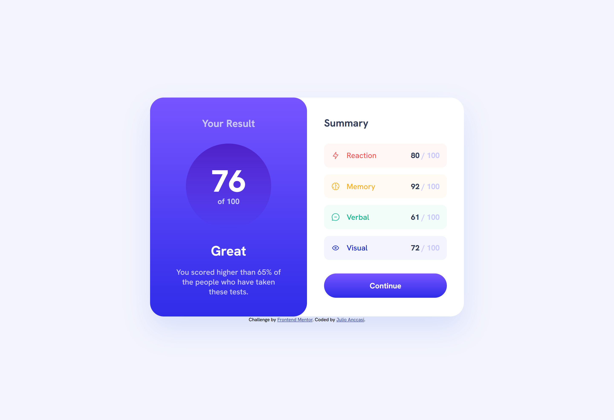

# Frontend Mentor - Results summary component solution

This is a solution to the [Results summary component challenge on Frontend Mentor](https://www.frontendmentor.io/challenges/results-summary-component-CE_K6s0maV). Frontend Mentor challenges help you improve your coding skills by building realistic projects.

## Table of contents

- [Frontend Mentor - Results summary component solution](#frontend-mentor---results-summary-component-solution)
  - [Table of contents](#table-of-contents)
  - [Overview](#overview)
    - [The challenge](#the-challenge)
    - [Screenshot](#screenshot)
    - [Links](#links)
  - [My process](#my-process)
    - [Built with](#built-with)
    - [What I learned](#what-i-learned)
    - [Continued development](#continued-development)
    - [Useful resources](#useful-resources)
    - [AI Collaboration](#ai-collaboration)
  - [Author](#author)

## Overview

### The challenge

Users should be able to:

- View the optimal layout for the interface depending on their device's screen size
- See hover and focus states for all interactive elements on the page
- **Bonus**: Use the local JSON data to dynamically populate the content

### Screenshot





### Links

- Solution URL: [https://github.com/ChechiX/results-summary-component-lit](https://github.com/ChechiX/results-summary-component-lit)
- Live Site URL: [https://results-summary-component-chechix.netlify.app/](https://results-summary-component-chechix.netlify.app/)

## My process

### Built with

- Semantic HTML5 markup
- CSS custom properties
- Flexbox
- CSS Grid
- Mobile-first workflow
- [Lit](https://lit.dev/) - JS library with typescript support for building web components

### What I learned

I learned how to use the [Lit Task](https://lit.dev/docs/components/tasks/) directive to handle asynchronous data fetching and rendering in a clean and efficient way. This allowed me to manage the different states of the data fetching process (loading, success, error) without having to write a lot of boilerplate code.

```ts
import { css, html, LitElement } from 'lit';
import { customElement } from 'lit/decorators.js';

import { Task } from '@lit/task';

import type { Results } from './interfaces/results-interface';

import './components/result-card';
import './components/summary-card';

@customElement('results-summary-component')
export class ResultsSummaryComponent extends LitElement {
  private _task = new Task(this, {
    task: async () => {
      const response = await fetch('/data.json');

      if (!response.ok) {
        throw new Error(response.statusText);
      }

      return response.json() as Promise<Results[]>;
    },
    args: () => [],
  });

  render() {
    return this._task.render({
      pending: () => html`<p>Loading...</p>`,
      complete: (results) => {
        const totalScore = results.reduce(
          (acc, result) => acc + result.score,
          0,
        );

        const averageScore = Math.floor(totalScore / results.length);

        return html`<main class="result-summary">
          <result-card score=${averageScore}></result-card>

          <summary-card .items=${results}></summary-card>
        </main>`;
      },
      error: (e) => html`<p>Error: ${e}</p>`,
    });
  }

  static styles = css`
    .result-summary {
      display: grid;
      gap: 24px;
      max-width: 42.875rem;
      margin: 0 auto;

      @media (min-width: 48rem) {
        grid-template-columns: repeat(2, 1fr);
        gap: 0;
        background-color: var(--white);
        border-radius: 32px;
        box-shadow: 0 30px 60px 0 rgba(61, 108, 236, 0.15);
        max-width: 46rem;
      }
    }
  `;
}
```

### Continued development

In future projects, I would like to explore more advanced features of Lit, such as reactive properties and custom events, to create more interactive and dynamic web components. I also want to improve my understanding of web component lifecycle methods and how to optimize performance when working with large datasets.

### Useful resources

- [Lit Async Task Documentation](https://lit.dev/docs/data/task/) - This documentation provided a great overview of how to use the Task directive to handle asynchronous data fetching and rendering in Lit. It helped me understand the different states of the data fetching process and how to manage them effectively.

### AI Collaboration

I used AI support through 6 chat sessions during this project.

- Tools used: GitHub Copilot Chat (primary), plus occasional comparisons with ChatGPT/Claude-style suggestions for explanation clarity.
- How I used AI:
  - To brainstorm the component structure and break the UI into reusable Lit web components.
  - To debug TypeScript and rendering issues while fetching local JSON data.
  - To validate responsive layout decisions (mobile-first, grid behavior, spacing, and sizing).
  - To review wording and improve documentation quality in this README.
- What worked well:
  - Fast feedback loops when I was blocked.
  - Helpful prompts for troubleshooting async rendering and state handling.
  - Better confidence in accessibility and semantic markup checks.
- What did not work as well:
  - Some suggestions were too generic and needed adaptation to this exact codebase.
  - I still had to verify outputs manually and test in the browser before applying changes.

Overall, AI was most useful as a pair-programming assistant for guidance and iteration, not as a replacement for implementation and testing.

## Author

- Frontend Mentor - [@ChechiX](https://www.frontendmentor.io/profile/ChechiX)
